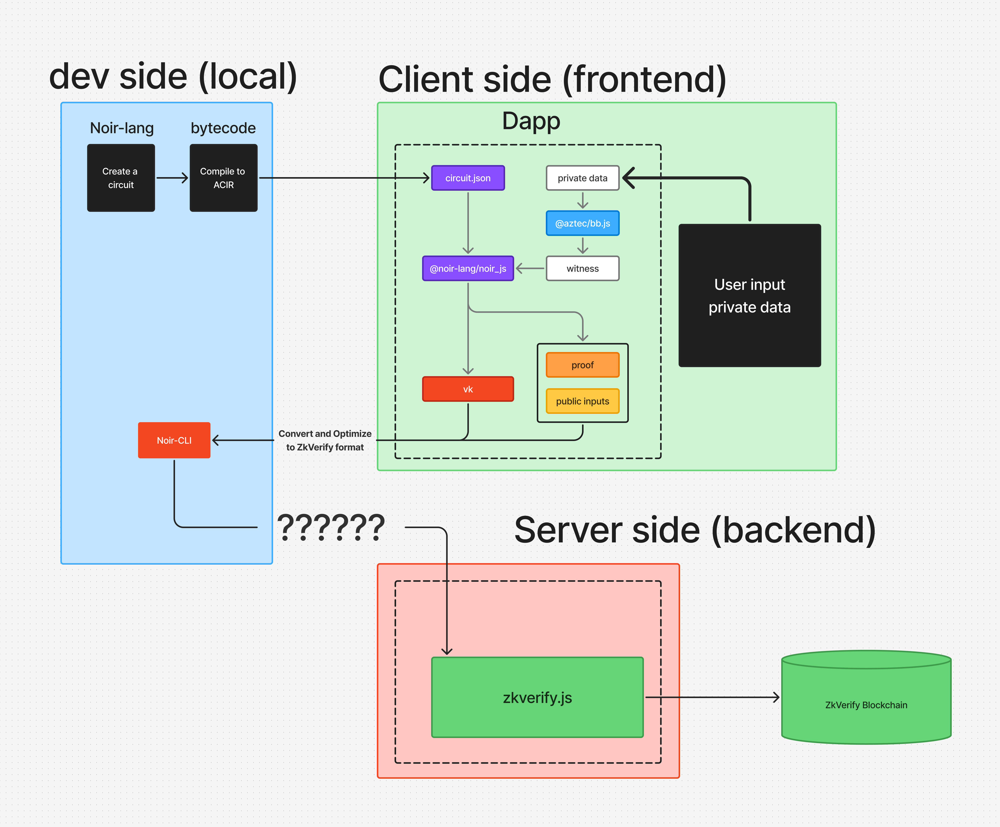
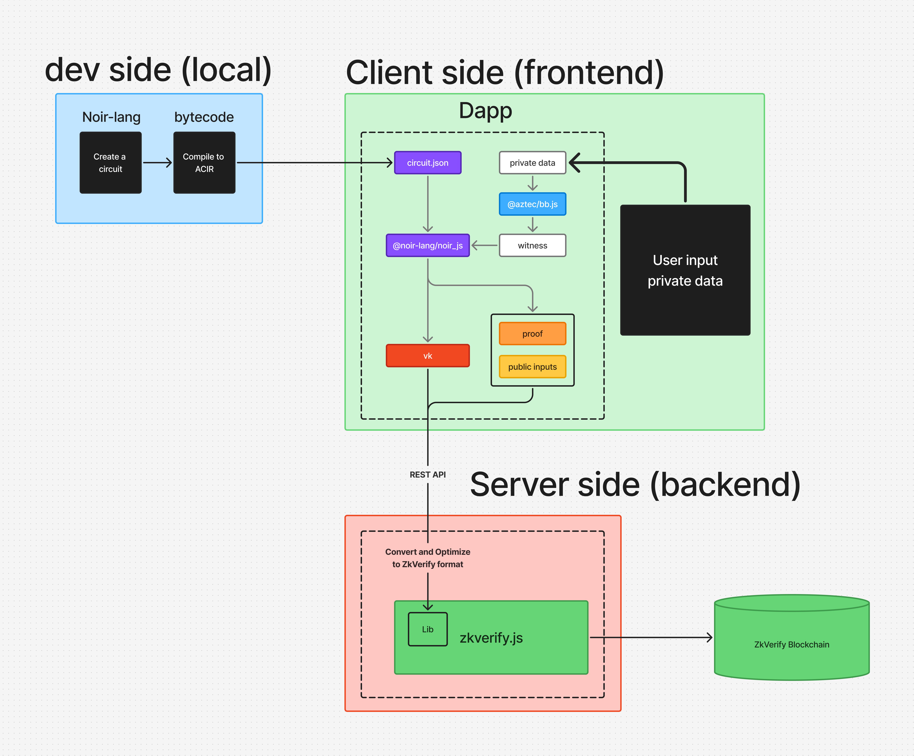
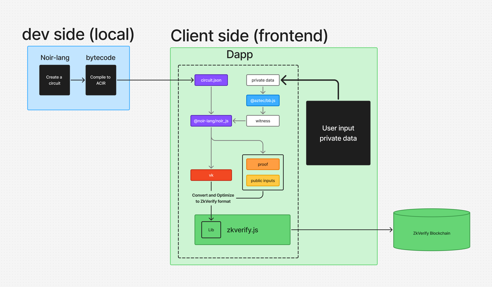

# Proposta de Solução: Ferramenta de Conversão zk-SNARK UltraPlonk → ZKVerify

## 1. **Resumo Executivo**

Atualmente, desenvolvedores que utilizam a stack Noir/Nargo com o backend UltraPlonk enfrentam uma limitação crítica: **a ausência de ferramentas para converter provas zk-SNARK geradas via CLI (`bb`) para um formato compatível com a ZKVerify**. Isso impede integrações frontend direto com verificadores modernos.

Desenvolvi uma **solução funcional (PoC/MVP)** que realiza essa conversão **nativamente em JavaScript e no navegador**, permitindo submeter provas diretamente à ZKVerify sem etapas manuais com CLI. Agora busco financiamento para transformar essa PoC em uma ferramenta completa e mantida pela comunidade.

---

## 2. **Problema Atual**

Desenvolvedores que trabalham com UltraPlonk enfrentam as seguintes barreiras:

- As provas geradas por `bb prove` são binárias (`.bin`) e incompatíveis com ZKVerify.
- A conversão para formato hex só é possível via CLI, impedindo uso em ambientes frontend/browser.
- Não existe uma solução oficial para conversão em tempo de execução via JavaScript.

---

## 3. **Solução Proposta**

Criação de uma **biblioteca JavaScript/TypeScript** open-source que:

- Converta provas e chaves `Uint8Array` geradas por `@aztec/bb.js` para `hex` no ambiente Node.js ou browser.
- Gere o formato de prova aceito pela ZKVerify a partir da estrutura UltraPlonk.
- Ofereça API de fácil uso para desenvolvedores Web3, DApps e ferramentas ZK.

> Essa biblioteca **já está funcional em uma PoC** e com provas de envio bem-sucedido para a ZKVerify.

# OR

---

## 4. **Prova de Viabilidade**

A PoC desenvolvida já demonstra que:

- A conversão pode ser feita inteiramente em node.js sem CLI.
- O formato convertido é aceito pela API da ZKVerify.
- Pode rodar em Node.js Backend

---

## 5. **Roadmap**

### Duração: **6 semanas**

### Entregáveis:

- 📦 Biblioteca NPM pública (ou atualização dentro da `zkverify.js`)
- 📘 Documentação com 2 exemplos de uso com envio direto para a ZKVerify: apenas frontend, frontend e backend.
- 🔬 Testes automatizados.
- 🌐 Demo em video para os 2 exemplos.
- 🧪 Scripts de benchmark de tempo e peso da conversão.

| Semana | Atividade                                            |
| ------ | ---------------------------------------------------- |
| 1      | Refatoração da PoC, definição de interfaces públicas |
| 2      | Implementação da conversão de provas e chaves        |
| 3      | Suporte para frontend (browser-friendly)             |
| 4      | Testes automatizados e documentação                  |
| 5      | Integração com ZKVerify + exemplo real               |
| 6      | Otimizações e publicação oficial no NPM + GitHub     |

---

## 6. **Impacto Esperado**

- Desbloqueio de novas integrações frontend com UltraPlonk.
- Incentivo ao uso da stack Noir/Nargo em produtos reais.
- Fortalecimento do ecossistema zk e da interoperabilidade com a ZKVerify.
